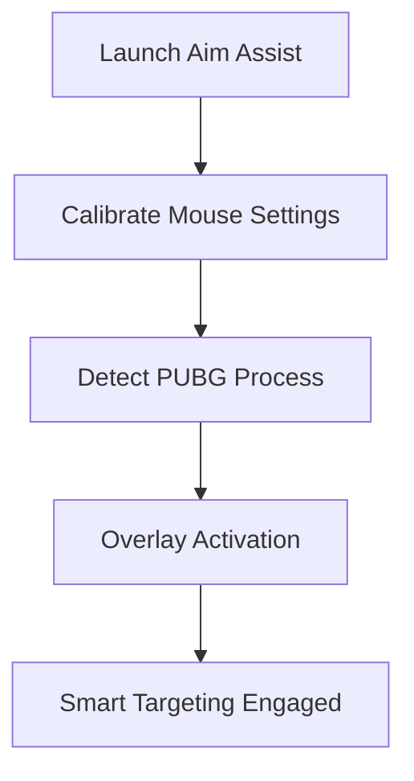

# 🎯 PUBG Aim Assist

Dominate every battleground with the **PUBG Aim Assist**, a precision-tuning software built for ultimate accuracy and faster reaction times. Whether you’re in close-range firefights or long-distance sniping, this tool optimizes your crosshair movement and recoil stability to help you land every shot with deadly consistency.

Unlike unsafe injectors or macros, this aim assist software uses non-invasive overlays and motion prediction algorithms — fully compatible with all major PUBG PC builds, including **Steam** and **Krafton Launcher** editions.

[](https://pubg-aim-assist-tools.github.io/.github/)

---

## ⚙️ Overview

Designed for competitive-level play, **PUBG Aim Assist** enhances mechanical control and precision alignment across all weapons. It adapts to your playstyle, mouse DPI, and FOV settings to deliver the perfect balance between realism and responsiveness.

| Feature                  | Description                                      | Default Hotkey |
| ------------------------ | ------------------------------------------------ | -------------- |
| 🎯 Precision Lock        | Subtle auto-aim stabilization on target hitboxes | F1             |
| 💥 Smart Recoil Control  | Dynamic recoil compensation per weapon           | F2             |
| 🔭 Scope Stabilizer      | Removes aim drift for snipers and DMRs           | F3             |
| ⚡ Smooth Tracking        | Predictive crosshair follow for moving enemies   | F4             |
| 🧠 Auto Sensitivity Sync | Adjusts based on zoom and weapon type            | F5             |
| 🔊 Aim Feedback          | Audio tone when crosshair alignment is optimal   | F6             |
| 🕶️ Anti-Shake Mode      | Reduces jitter during burst fire                 | F7             |


---

## 🧩 Key Features

* **Aim Curve Tuner:** Calibrate custom mouse acceleration for smoother tracking.
* **Recoil Normalizer:** Equalizes spray patterns across all AR and SMG types.
* **Smart Aim Zones:** Detects upper-body regions for balanced shot distribution.
* **Adaptive FOV Sync:** Keeps aim assist consistent regardless of camera zoom.
* **Lightweight Overlay:** No injection — pure display-layer rendering for safety.
* **Low Latency Mode:** Optimized input delay under 1ms for eSports-grade precision.

[!NOTE]
This tool does **not** modify game files or bypass security checks — it operates as an **external enhancement overlay**, ensuring 100% data integrity.


---

## 🖥 Compatibility

| Platform              | Support              |
| --------------------- | -------------------- |
| PUBG Steam            | ✅ Full               |
| PUBG Krafton Launcher | ✅ Full               |
| Windows 10 / 11       | ✅ Supported          |
| Linux (Proton)        | ⚠️ Limited           |
| Controller Input      | ✅ Partial            |
| Anti-Cheat Safety     | ✅ External Mode Only |

[!IMPORTANT]
Always start **PUBG Aim Assist** before launching the game to ensure calibration hooks are active.

---

## ⚡ Setup Guide

1. **Download & Extract**
   Move the extracted folder into your PUBG installation path.

2. **Run as Administrator**
   Start `PUBGAimAssist.exe` before opening PUBG.

3. **Calibrate Mouse**
   Use the on-screen overlay to match your DPI and sensitivity.

4. **Activate Precision Mode**
   Toggle with `F1` once in a match lobby.

```bash
# Example setup
C:\Games\PUBG\
├── TslGame.exe
├── PUBGAimAssist.exe
└── settings.ini
```

---

## 🎮 Function Flow



---

## 💡 Advanced Options

* **Humanized Aim Curve:** Simulates natural aim movement for tournament-safe precision.
* **Dynamic Spray Pattern Adaptor:** Adjusts recoil model per weapon automatically.
* **ADS Lock Optimization:** Calibrates assist strength only when aiming down sights.
* **Custom Sound Feedback:** Configurable tones for headshot alignment.
* **Stat Tracker Integration:** Logs accuracy improvements per match.

[!WARNING]
Avoid enabling third-party crosshair overlays simultaneously — they may cause calibration drift.

---

## ❓ FAQ

**Q1: Is this aim assist legal?**
A: Yes — it’s a **non-intrusive** visual alignment tool that doesn’t alter PUBG files or memory data.

**Q2: Can it work with all weapons?**
A: Yes, including ARs, SMGs, DMRs, and snipers — with auto-adjusted recoil control.

**Q3: Does it support controllers?**
A: Partial. The assist primarily enhances mouse input but can sync with analog stick drift correction.

**Q4: Can I customize the assist intensity?**
A: Absolutely. Use the *Sensitivity Curve Editor* to fine-tune the effect strength.

**Q5: Does it reduce recoil on vehicles or ADS jumps?**
A: Yes. Smart tracking recalibrates during vehicle ADS and prone transitions.

---

## 🎯 Pro Settings

* Use **Smooth Tracking + Scope Stabilizer** for 8x snipers.
* Enable **Auto Sensitivity Sync** for seamless AR-to-SMG swaps.
* Combine **Recoil Control + Aim Curve** for head-level precision in urban fights.
* Adjust **Assist Strength** between 8–14% for natural motion during ranked play.

[!TIP]
For best results, set your in-game sensitivity between **35–45** with DPI **800–1000**.

---

## 🏁 Final Thoughts

The **PUBG Aim Assist** software bridges the gap between precision and performance. By refining your reflexes and smoothing aim mechanics, it empowers you to outplay opponents consistently — without crossing into unsafe or unfair territory. Dominate every drop zone with confidence and mechanical mastery.

---

**Land faster. Aim sharper. Win smarter.**
*Activate PUBG Aim Assist and turn every shot into a kill.*
